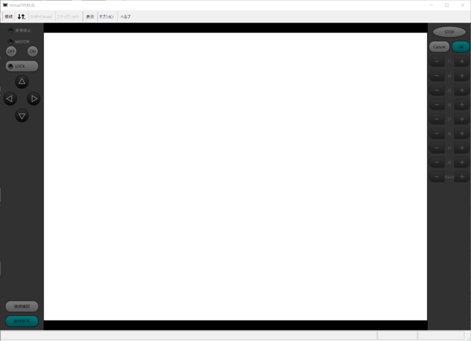

# jsk_denso_robot


ROS package for Denso robot.
- Non-OSS type robot using b-CAP communication
- OSS type robot


## Non-OSS type

### How to setup development environment

Use `wstool`, `rosdep` and `catkin` to checkout and compile the source tree.

```
mkdir -p ~/denso_ws/src
cd ~/denso_ws/src
wstool init
wstool merge https://raw.githubusercontent.com/jsk-ros-pkg/jsk_robot/master/jsk_denso_robot/denso.rosinstall
wstool update
cd ../
git clone https://github.com/k-okada/cobotta_descriptions.git
(cd src/denso_robot_ros/denso_robot_descriptions; ln -sf ../../../cobotta_descriptions/cobotta_description .)
source /opt/ros/melodic/setup.bash
rosdep install -y -r --from-paths src --ignore-src
catkin build cobottaeus jsk_cobotta_startup -vi
source devel/setup.bash
```

### COBOTTA Setup

Please refer to [COBOTTA User Manuals](https://www.fa-manuals.denso-wave.com/jp/COBOTTA/007030/) to setup your robot.
To install Virtual TP software, please refer to [Software Install](https://www.fa-manuals.denso-wave.com/jp/COBOTTA/007263/) section of the User Manuals.

### Start Virtual IP

To control the robot, you need to start Virtual TP software and push top-left 'Connect' menu.




Then you need to input the IP address of your robot. The default robot IP address is '192.169.0.1'.


To control the robot, you need to specify user level and password. The default password can be found on [COBOTTA User Manuals](https://www.fa-manuals.denso-wave.com/jp/COBOTTA/007030/).


You can skip calibration section and also put "Prepare Motion".


This is main user interface. You can push 'cancel' button on right-top to back to this panel.


#### Setup IP address of the robot

You may want to change IP address of the robot, to connect your network. To do this, please push "Setting" button on the right bottom.


Then push 'Network and communication (F2)'.


Now, you can change IP address.


You can set the IP address by using this 10-key like interface. You need to push 'OK' button of 10-key like panel, and then push 'OK' button of 'Communication Setting' panel.


#### Setup IP address of client computer

To work with ROS node. You need to tell IP address of your ROS node running computer to the robot.
This is called 'executable' and you need to set 'executable' IP address from Virtual TP software.

From main panel, push "Setting" button on the right bottom.


Then push 'Executable (F1)'


Select 'Ethernet' tab and change IP address.


You can set the IP address by using this 10-key like interface. You need to push 'OK' button of 10-key like panel, and then push 'OK' button of 'Communication Setting' panel.

### Start ROS Node

```
source ~/denso_ws/devel/setup.bash
roslaunch --screen jsk_cobotta_startup cobotta_bringup.launch ip_address:=192.168.0.1
```

Make sure that `ip_address` is set by [Setup IP address of the robot](#setup-ip-address-of-the-robot) and your ROS client node IP address is set by [Setup IP address of client computer](#setup-ip-address-of-client-computer).

### Use EusLisp model

To control the robot from EusLisp. Please start `roseus` and type as follows.

```
(load "package://cobottaeus/cobotta-interface.l")
(cobotta-init)
```

Use `:angle-vector` method to specify the arm joint angle.
```
(send *cobotta* :angle-vector #f(0 20 80 0 20 0.0))
```


You can also use `:inverse-kinematics` method to specify the arm pose from target coordinates.
```
(send *cobotta* :arm :inverse-kinematics (make-coords :pos #f(150 0 50) :rpy (float-vector pi  0 pi)) :debug-view t)
```

To move the gripper 50 [mm] up, you can use `move-end-pos` method.
```
(send *cobotta* :arm :move-end-pos #f(0 0 -50))
```

You can also use `move-end-rot` method to turn the gripper.
```
(send *cobotta* :arm :move-end-rot -90 :z)
```


To control real robot, you can use `*ri*` object.
```
(send *ri* :angle-vector (send *cobotta* :angle-vector) 2000)
```
`2000` indicates we ask robot to move for `2000 [msec]`

To obtain current robot pose, use `:state :potentio-vector` method.
```
(send *ri* :state :potentio-vector)
```

To open and close the gripper, you can use `:start-grasp` and `:stop-grasp`.
```
(send *ri* :stop-grasp)
(send *ri* :start-grasp)
```

`:start-grasp` method returns `t` if it succeeded to grasp object. If it returns `nil`, nothing was grasped.

When the robot detects errors, the LED of the robot becomes yellow or red. Or you can find warning message like follows.
```
[ WARN] [1607683352.232275227]: Call {func_id: 72, vntArgs: ({vt: 3, value: 182} {vt: 3, value: 1} {vt: 8, value: P(210.0,0.0,-60.0,180.0,0.0,80.0,261)} {vt: 8, value: })}
-2111814862 -7ddfbcce
[ WARN] [1607683352.232440142]:  ** ERROR_CODE 82204332 (Unknown error message) **
```
In this situation, you can clear error by
```
(send *ri* :clear-error)
```

If error still occurs, try `:dispose` and `:init` again.
```
(send *ri* :dispose)
(send *ri* :init)
```

## COBOTTA OSS type

### Official documents

- [ROS Wiki](http://wiki.ros.org/denso_cobotta_ros)
- [Web manual](https://densorobot.github.io/docs/denso_cobotta_ros)
- [Driver page](https://www.denso-wave.com/ja/robot/download/application/cobotta_driver_for_linux.html)

### How to setup development environment on your PC

If you already setup environment for Non-OSS type, you can reuse it.
Just in case, do `wstool update` and `catkin build cobottaeus jsk_cobotta_startup -vi` again.
Otherwise, do the following:
```bash
mkdir -p ~/denso_ws/src
cd ~/denso_ws/src
wstool init
wstool merge https://raw.githubusercontent.com/jsk-ros-pkg/jsk_robot/master/jsk_denso_robot/denso.rosinstall
wstool update
cd ../
source /opt/ros/melodic/setup.bash
rosdep install -y -r --from-paths src --ignore-src
catkin build cobottaeus jsk_cobotta_startup -vi
source devel/setup.bash
```

### COBOTTA Setup

#### 1st step: setup Denso default environment

Basically, refer to the documents in the file downloaded from [Driver page](https://www.denso-wave.com/ja/robot/download/application/cobotta_driver_for_linux.html) to setup your robot.
But please read the following before setup:

- After installing Ubuntu on the robot, you should install and use the Kernel version supported by COBOTTA.
  Supported versions are listed on README in the top directory.
  You should install and use the latest version currently supported (hereinafter `XX`, e.g., `5.4.0-58-generic`):
  ```bash
  sudo apt install linux-image-XX
  sudo apt install linux-modules-extra-XX
  sudo vi /etc/default/grub  # Set GRUB_DEFAULT as "Ubuntu, with Linux XX"
  sudo update-grub
  # cf. https://askubuntu.com/questions/68547/editing-the-default-boot-item-in-grub-menu-a-definitive-answer
  ```
  After this, you should reboot the robot by turn the switch OFF and ON.

- By default, you should load the driver and change permission of the device file every time rebooting the robot.
  If you want the robot to execute them automatically, do the following setting:
  ```bash
  echo -e '#!/bin/bash\nsudo modprobe denso_cobotta io_power_mode=1\nsudo chown [YOUR LOGIN NAME]:[YOUR LOGIN GROUP] /dev/denso_cobotta' > ~/cobotta_startup.sh
  chmod +x ~/cobotta_startup.sh
  sudo bash -c "echo -e '@reboot root /home/[YOUR LOGIN NAME]/cobotta_startup.sh\n' > /etc/cron.d/cobotta_startup"
  ```

#### 2nd step: setup JSK environment

```bash
source ~/[WORKSPACE YOU CREATED AT 1ST STEP]/devel/setup.bash
mkdir -p ~/jsk_ws/src
cd ~/jsk_ws/src
git clone https://github.com/jsk-ros-pkg/jsk_robot.git
cd ../
rosdep install -y -r --from-paths src/jsk_robot/jsk_denso_robot --ignore-src
catkin build cobottaeus jsk_cobotta_startup -vi
source devel/setup.bash
```

### Start ROS Node

Run the following inside the robot (via SSH or keyboard):
```bash
roslaunch jsk_cobotta_startup cobotta_oss_bringup.launch
```

### Use EusLisp model

Almost the same as [the instruction of COBOTTA non-OSS type](#use-euslisp-model) except:

- Model loading should be:
  ```lisp
  (load "package://cobottaeus/cobotta-oss-interface.l")
  (cobotta-oss-init)
  ```
- Warning message while the robot detects errors is mainly displayed on `cobotta_oss_bringup.launch`
- After clearing error (`(send *ri* :clear-error)`), you should call `(send *ri* :motor-on)` to return your robot to normal state
- `(send *ri* :dispose)` is not implemented (we do not think this is needed on OSS type)

---
If you have any question, please feel free to file open at https://github.com/jsk-ros-pkg/jsk_robot/issues
