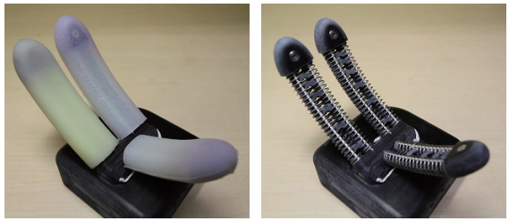
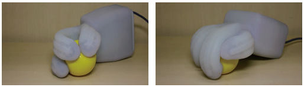

# softhand_ros

ROS package for SoftHand

## Note

This package depends on the branch below.

- [pazeshun/dynamixel_motor@gripper-v6-devel](https://github.com/pazeshun/dynamixel_motor/tree/gripper-v6-devel)

## Citation

### Softhand v1

```
@INPROCEEDINGS{hirose_softhand_v1,
  author={Hirose, Toshinori and Kakiuchi, Yohei and Okada, Kei and Inaba, Masayuki},
  booktitle={2019 IEEE/RSJ International Conference on Intelligent Robots and Systems (IROS)}, 
  title={Design of Soft Flexible Wire-driven Finger Mechanism for Contact Pressure Distribution}, 
  year={2019},
  volume={},
  number={},
  pages={4699-4705},
  doi={10.1109/IROS40897.2019.8968011}
}
```

### Softhand v2

```
@INPROCEEDINGS{hirose_softhand_v2,
  author={Hirose, Toshinori and Kitagawa, Shingo and Hasegawa, Shun and Kakiuchi, Yohei and Okada, Kei and Inaba, Masayuki},
  booktitle={2022 IEEE 5th International Conference on Soft Robotics (RoboSoft)}, 
  title={Waterproof Soft Robot Hand with Variable Stiffness Wire-driven Finger Mechanism Using Low Melting Point Alloy for Contact Pressure Distribution and Concentration}, 
  year={2022},
  volume={},
  number={},
  pages={109-116},
  doi={10.1109/RoboSoft54090.2022.9762208}
}
```

## Installation

### Workspace build

```bash
source /opt/ros/$ROS_DISTRO/setup.bash
mkdir ~/softhand_ws/src -p
cd ~/softhand_ws/src
wget https://raw.githubusercontent.com/knorth55/softhand_ros/master/fc.rosinstall -O .rosinstall
wstool up
rosdep install --ignore-src --from-paths . -y -r -i
cd ~/softhand_ws
catkin build
```

### Udev installation

```bash
source ~/softhand_ws/devel/setup.bash
roscd softhand_ros
sudo cp udev/*.rules /etc/udev/rules.d
sudo service udev reload
sudo service udev restart
```

## Softhand Description

### Softhand v1

Softhand V1 is designed for contact pressure distribution.

The hand can grasp soft and fragile object with low power,
and solid and heavy object with high power.

For more detailed information, please read [Design of Soft Flexible Wire-driven Finger Mechanism for Contact Pressure Distribution](https://ieeexplore.ieee.org/document/8968011)



###  Softhand v2

Softhand V2 is designed for waterproof and variable stiffness.

The hand can grasp as softhand v1, but also can massage human's head and hair.

For more detailed information please read [Waterproof Soft Robot Hand with Variable Stiffness Wire-driven Finger Mechanism Using Low Melting Point Alloy for Contact Pressure Distribution and Concentration](https://ieeexplore.ieee.org/document/9762208).



## How to use

### Launch softhand

#### For softhand v1

```bash
source ~/softhand_ws/devel/setup.bash
# for left softhand v1
roslaunch softhand_ros softhand_left.launch
# for right softhand v1
roslaunch softhand_ros softhand_right.launch
```

#### For softhand v2

```bash
source ~/softhand_ws/devel/setup.bash
# for left softhand v2
roslaunch softhand_ros softhand_v2_left.launch
# for right softhand v2
roslaunch softhand_ros softhand_v2_right.launch
```

### Control softhand by euslisp

#### For softhand v1

```bash
source ~/softhand_ws/devel/setup.bash
roscd softhand_ros/euslisp
roseus softhand-interface.l
# euslisp interactive mode
# (softhand-init)
# (send *ri* :start-grasp)
# (send *ri* :stop-grasp)
```

#### For softhand v2

```bash
source ~/softhand_ws/devel/setup.bash
roscd softhand_ros/euslisp
roseus softhand-v2-interface.l
# euslisp interactive mode
# (softhand-v2-init)
# (send *ri* :close-thumb)
# (send *ri* :open-thumb)
# (send *ri* :start-grasp)
# (send *ri* :stop-grasp)
```

## Softhand hardware installation

### Softhand v1 dynamixel setup

#### Check default parameters of dynamixel

Motor's default id is `1` and default baud rate is `57600`.

```bash
rosrun dynamixel_driver info_dump.py -b 57600 -p /dev/{l/r}hand-e160 1
```

#### Set baud rate

```bash
# set baud rate from 57600 to 1000000
rosrun dynamixel_driver set_servo_config.py -b 57600 -r 1 <MOTOR_ID> -p /dev/{l/r}hand-e160
```

#### Set motor ID

- 1: Thumb
- 2: Index finger
- 3: Middle finger

```bash
rosrun dynamixel_driver change_id.py <OLD_MOTOR_ID> <NEW_MOTOR_ID> -b 1000000 -p /dev/{l/r}hand-e160
```

#### Disable overload error

```python
from dynamixel_driver import dynamixel_io

# for softhand v1
dxl_io = dynamixel_io.DynamixelIO("/dev/{l/r}hand-e160", 1000000)
dxl_io.write(<MOTOR_ID>, 17, (4,))
dxl_io.write(<MOTOR_ID>, 18, (4,))
```

### Softhand v2 dynamixel setup

#### Check default parameters of dynamixel

Motor's default id is `1` and default baud rate is `57600`.

```bash
rosrun dynamixel_driver info_dump.py -b 57600 -p /dev/{l/r}hand-e160 1
```

#### Set baud rate

```bash
# set baud rate from 57600 to 57143
rosrun dynamixel_driver set_servo_config.py -b 57600 -r 34 <MOTOR_ID> -p /dev/{l/r}hand-v2-e160
```

#### Set motor ID

- 1: Thumb
- 2: Index finger
- 3: Middle finger

```bash
rosrun dynamixel_driver change_id.py <OLD_MOTOR_ID> <NEW_MOTOR_ID> -b 57600 -p /dev/{l/r}hand-v2-e160
```

#### Disable overload error

```python
from dynamixel_driver import dynamixel_io

# for softhand v2
dxl_io = dynamixel_io.DynamixelIO("/dev/{l/r}hand-v2-e160", 57600)
dxl_io.write(<MOTOR_ID>, 17, (4,))
dxl_io.write(<MOTOR_ID>, 18, (4,))
```

### Change `product` to distinguish E160 board

This is for [USB2TTL dongle](https://www.besttechnology.co.jp/modules/onlineshop/index.php?fct=photo&p=268) and [DXSharingBoard(TTL)](https://www.besttechnology.co.jp/modules/onlineshop/index.php?fct=photo&p=195)

We distinguish left and right hand with `product` field of FTDI chip on E160.

- Left softhand v1 E160's `product`: `LEFT-E160`
- Right softhand v1 E160's `product`: `RIGHT-E160`
- Left softhand v2 E160's `product`: `LEFT-V2-E160`
- Right softhand v2 E160's `product`: `RIGHT-V2-E160`

In order to change them, please follow [jsk_apc doc](https://jsk-apc.readthedocs.io/en/latest/jsk_arc2017_baxter/setup_gripper_v6.html#distinguish-left-dxhub-from-right-one).

If you don't have windows, you can do it with [richardeoin/ftx-prog](https://github.com/richardeoin/ftx-prog) as follows.

```bash
git clone https://github.com/richardeoin/ftx-prog.git
cd ftx-prog/
make
# for left softhand v1
sudo ./ftx_prog --product LEFT-E160
# for right softhand v1
sudo ./ftx_prog --product RIGHT-E160
# for left softhand v2
sudo ./ftx_prog --product LEFT-V2-E160
# for right softhand v2
sudo ./ftx_prog --product RIGHT-V2-E160
```
