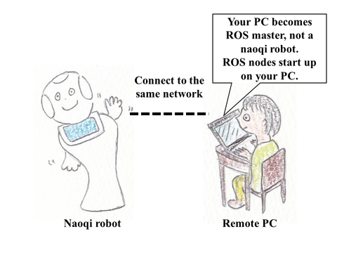

# jsk_naoqi_robot

JSK original ROS package for NAO and Pepper.
The package name comes from Naoqi OS they use.

## How to start up ROS nodes for a naoqi robot? 



Your PC becomes ROS master. Your PC connects to a naoqi robot and starts up ROS nodes (`jsk_nao_startup.launch` and `jsk_pepper_startup.launch`).  
You can control NAO and Pepper via roseus (`naoeus` and `peppereus`).
For more information about these programs, please refer to [here for NAO](https://github.com/jsk-ros-pkg/jsk_robot/tree/master/jsk_naoqi_robot#nao) and [here for Pepper](https://github.com/jsk-ros-pkg/jsk_robot/tree/master/jsk_naoqi_robot#pepper).

### How to turn on/off a naoqi robot?

- On

Please refer to [NAO's page](http://doc.aldebaran.com/2-1/nao/nao-turn-on.html) and [Pepper's page](http://doc.aldebaran.com/2-4/family/pepper_user_guide/turn_on_pep.html).

- Off

Please refer to [NAO's page](http://doc.aldebaran.com/2-1/nao/nao-turn-off.html) and [Pepper's page](http://doc.aldebaran.com/2-4/family/pepper_user_guide/turn_off_pep.html). 

- Disable AutonomousLife

Naoqi robot has [AutonomousLife](http://doc.aldebaran.com/2-4/family/pepper_user_guide/life_pep.html) in addition to a normal concept of servo on and off.  

When you're a developer, you'll want to disable AutonomousLife (it includes servo off) and servo on a robot to try codes you write.

If you want to know how to disable it, please refer to [using a chest button](http://doc.aldebaran.com/2-4/family/pepper_user_guide/freeze_pep.html). Link is for Pepper, but same as NAO.  

Or please refer to [using ROS service](doc/disable_autonomous_life_from_ros_service.md). 

### How to connect your PC and a robot to a same network?

- Network with DHCP

To connect NAO and Pepper to wifi for the first time, please refer to [here](doc/connect_to_wifi.md).

- Network without DHCP (link-local addressing)

Please refer to [here](http://doc.aldebaran.com/2-1/nao/connectivity.html#local-link-an-alternative-to-dhcp).  

[2019.03.01: Trouble shooting]

When you connect Pepper and your PC via network without DHCP, power on Pepper and launch Setting from Pepper's tablet, setting wizard sometimes becomes zombie process. You may not exit Setting as described [here](https://github.com/jsk-ros-pkg/jsk_robot/blob/master/jsk_naoqi_robot/doc/connect_to_wifi.md#pepper-only-how-to-access-to-a-robot-web-page-via-peppers-tablet), which causes a failure of AutonomousLife setting.

```
[ERROR] [1550641271.575637]: Exception while disabling life state: ALAutonomousLife::setState AutonomousLife::setState Calls to the setState method are not currently allowed. Did you finish the getting started wizard?
```

If this happens, please connect Pepper to network with DHCP and exit Setting.

## Setup Environment

% First, you need to install ros. 
For ros kinetic, please refer to install guide like [here](http://wiki.ros.org/kinetic/Installation).
For ros melodic, please refer to install guide like [here](http://wiki.ros.org/melodic/Installation).

1. Install ``Python NAOqi SDK``
You can download it (version = 2.5.5) from [here](https://drive.google.com/file/d/1xHuYREDa78xGiikEpsjxfZQ7Gfvo1E9D/view?usp=sharing).  
Please unzip the downloaded file.  
Please create ``pynaoqi`` folder in your home directory.  
Then put the file under your ``pynaoqi`` folder.  

% You can download other version SDKs from [here](https://www.softbankrobotics.com/emea/en/support/nao-6/downloads-softwares/former-versions?os=49&category=39). Please change the tab to SDKs. Version < 2.5.5 may cause error.

2. Export environment variables in your ``.bashrc``

```
# Please use Python NAOqi SDK version >= 2.5.5 (https://github.com/jsk-ros-pkg/jsk_robot/issues/1099)
export PYTHONPATH=$HOME/pynaoqi/pynaoqi-python2.7-2.5.5.5-linux64/lib/python2.7/site-packages:$PYTHONPATH

export NAO_IP="olive.jsk.imi.i.u-tokyo.ac.jp" % OR IP address like "133.11.216.xxx"
export ROS_IP="133.11.216.yyy" % OR run rossetip command to set ROS_IP
```
% `pose_controller.py` in `naoqi_pose` package imports `NaoqiNode` from `naoqi_node.py` in `naoqi_driver_py` package.

% `naoqi_node.py` imports `ALProxy` from `naoqi.py`.

% `naoqi.py` is located under `pynaoqi-python2.7-2.5.5.5-linux64/lib/python2.7/site-packages/`


% NAO_IP is IP address of Pepper. Pepper tells you their address when pushing their belly button.

% Please install ```ros-${ROS_DISTRO}-jsk-tools``` to use ```rossetip``` command.


3. Install ROS packages for NAO and Pepper

```
mkdir -p catkin_ws/src
cd  catkin_ws
wstool init src
wstool merge -t src https://raw.githubusercontent.com/jsk-ros-pkg/jsk_robot/master/jsk_naoqi_robot/naoqi.rosinstall
wstool update -t src
source /opt/ros/${ROS_DISTRO}/setup.bash
rosdep install -y -r --from-paths src --ignore-src
```

Then, please install Nao/ Pepper mesh files from deb with manual approval of license.  

```
sudo apt-get install ros-${ROS_DISTRO}-pepper-meshes
sudo apt-get install ros-${ROS_DISTRO}-nao-meshes
```

Note that `naoqi.rosinstall` includes necessary patches for ROS kinetic, such as [naoqi_dashboard (kochigami-develop)](https://github.com/kochigami/naoqi_dashboard/tree/kochigami-develop).

Finally, please compile them.  

```
catkin build peppereus
catkin build jsk_pepper_startup
catkin build naoeus
catkin build jsk_nao_startup
source devel/setup.bash
```

% Inside `jsk_robot` package, there are many packages which are not required for `jsk_naoqi_robot`. If we fail to compile them, building process might stop and `jsk_naoqi_robot` packages might not be compiled. We might need to continue compiling (`catkin build --continue-on-failure`) in that case.


4. (optional) For NAO and Pepper developers

Confirm that you get the following output when you type `wstool info`

```
$ cd ~/catkin_ws/src
$ wstool info
workspace: /home/leus/catkin_ws/src

 Localname         S SCM Version (Spec)    UID  (Spec)  URI  (Spec) [http(s)://...]
 ---------         - --- --------------    -----------  ---------------------------
 pepper_robot        git master  (-)       efad3979b374 github.com/ros-naoqi/pepper_robot
 naoqi_driver      M git kochigami-develop 98c0b678286a github.com/kochigami/naoqi_driver
 naoqi_dashboard     git kochigami-develop 33962f146c77 github.com/kochigami/naoqi_dashboard
 naoqi_bridge_msgs   git kochigami-develop d7417613690e github.com/kochigami/naoqi_bridge_msgs
 naoqi_bridge        git kochigami-develop c28b727e1e9b github.com/kochigami/naoqi_bridge
 nao_robot           git master  (-)       67476469a137 github.com/ros-naoqi/nao_robot
 nao_interaction     git master  (-)       f97ad12f3896 github.com/ros-naoqi/nao_interaction
 jsk_robot           git master            1f44c97c7855 github.com/jsk-ros-pkg/jsk_robot.git
```

## Interface when controlling NAO and Pepper via roseus

Common methods for NAO and Pepper are defined in `naoqieus/naoqi-interface.l`. NAO-specific methods are defined in `naoeus/nao-interface.l`. Pepper-specific methods are defined in `peppereus/pepper-interface.l`. For further details about each method, please refer to [**_naoqieus_**](naoqieus/README.md), [**_naoeus_**](naoeus/README.md), and [**_peppereus_**](peppereus/README.md) respectively.  
For some methods, they require specific branch (kochigami-develop) because they are not merged into master. [naoqi.rosinstall](https://raw.githubusercontent.com/jsk-ros-pkg/jsk_robot/master/jsk_naoqi_robot/naoqi.rosinstall) file includes this branch for `naoqi_driver`, `naoqi_bridge` and `naoqi_bridge_msgs` repositories.

## NAO & Pepper

[**_naoqieus_**](naoqieus/README.md)
  - common interface package for controlling NAO and Pepper via roseus

To connect NAO and Pepper to wifi, please refer to [here](doc/connect_to_wifi.md).

To control multiple robots in one PC, please refer to [here](doc/control_multiple_robots_in_one_pc.md).

To control NAO and Pepper via gazebo simulator and roseus, please refer to [here](doc/simulator.md).

## NAO

[**_jsk_nao_startup_**](jsk_nao_startup/README.md)
  - contains ROS launch files for NAO

[**_naoeus_**](naoeus/README.md)
  - package for controlling NAO via roseus

## Pepper

[**_jsk_pepper_startup_**](jsk_pepper_startup/README.md)
  - contains ROS launch files for Pepper

[**_peppereus_**](peppereus/README.md)
  - package for controlling Pepper via roseus

[**_jsk_201504_miraikan_**](jsk_201504_miraikan/README.md)
  - demo package which Pepper introduces themselves

## Troubleshooting

* [Pepper Only] If you use Ubuntu 18.04, it is possible that you can't run `jsk_pepper_startup.launch` as reported in [this issue](https://github.com/jsk-ros-pkg/jsk_robot/issues/1474#issuecomment-1110768907). In that case, you may need to set audio `false` in `~/catkin_ws/src/naoqi_driver/share/boot_config.json`. Note that this means you can't subscribe audio topic.

  ```
  "audio":
  {
    "enabled"       : false
  },
  ```

* If you have the error about naoqi_dashboard, the following methods will probably work.

  Install goobject
  ```
  $ sudo apt install python-gobject-2
  ```

* If you connect to the robot using LAN cable, you need to set argument `network_interface` when launch `jsk_pepper_startup.launch`

  ```
  $ roslaunch jsk_pepper_startup jsk_pepper_startup.launch network_interface:=enp0s31f6
  ```

* If the getting started wizard appears on Pepper's tablet, please try following methods.

  `ssh nao@<Pepper's IP>` and

  ```
  $ qicli call ALBehaviorManager.isBehaviorRunning boot-config
  $ qicli call ALBehaviorManager.stopBehavior boot-config
  ```
