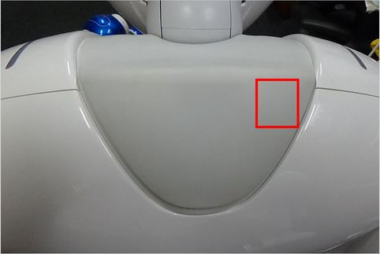
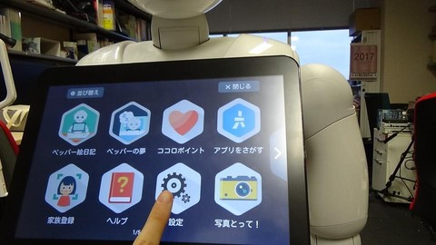
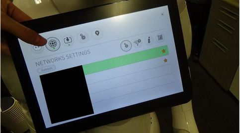

# Connect a robot to wifi

## Introduction

In order to use a real robot, you have to connect your robot and your PC to same network.

You can choose wired / wireless network.  

## How to know IP address of a robot?

A robot speaks IP address when you push a chest button once.  

If a robot says no network is connected, you have to connect a robot to wired LAN first.  

## How to connect a robot to wired LAN?

NAO's port is located in back of NAO's head.  

Pepper's port is also located in back of Pepper's head.  
You have to take off Pepper's head cover with a special key.  

1. The special key is located in here. Please remove this cover.  

2. Insert this key into two holes in Pepper's head. Then, you can remove head cover.

3. You can see Pepper's port. 

After connecting a wired LAN cable, please push a chest button once. A robot will speak IP address.  

## How to connect a robot to wireless LAN?

After connecting your robot to wired network, you have to access to a robot web page.  

For further details, please refer to [here (for NAO)](http://doc.aldebaran.com/2-4/nao/webpage.html#access-webpage-nao), [here (for Pepper)](http://doc.aldebaran.com/2-4/family/pepper_user_guide/webpage.html#accessing-the-pepper-web-page).  

Then, you will see a robot web page.  

Select a button like a shape of the earth and move to Network Settings.

Finally, you can connect your robot to wireless network.  

For further details, please refer to [here](http://doc.aldebaran.com/2-4/nao/nao-connecting.html#standard-wifi-connection).  

## (Pepper Only) How to access to a robot web page via Pepper's tablet?

First of all, please touch Pepper's tablet and select "Setting".  

Then, Pepper starts loading setting.  

Select a button like a shape of the earth. Other steps are same as above.  

After finishing setting network, please exit this page. That is because Pepper keeps taking same pose like this picture.  

