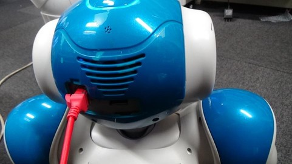

# Connect a robot to wifi

## Introduction

In order to use a real robot, you have to connect your robot and your PC to same network.

You can choose wired / wireless network.  

## How to know IP address of a robot?

A robot speaks IP address when you push a belly button once.  

If a robot says no network is connected, you have to connect a robot to wired LAN first.  

## How to connect a robot to wired LAN?

Then, when you push a belly button once, a robot will speak IP address.  

## How to connect a robot to wireless LAN?

You have to access to a robot web page.

First, write the IP address which a robot speaks to a web screen.

Enter ID and password. ID is `nao` and password is `nao` for NAO, but for Pepper, it is unique because it was set by you.
Then, you will see a robot web page.  

Select a button like the earth and move to Network Settings.

TODO

## (Pepper Only) How to access to a robot web page via Pepper's tablet?

First touch Pepper's tablet and select "Setting".  

Pepper starts loading setting.  

Select a button like the earth, other steps are same as above.  

After finishing setting network, please exit this page because Pepper keeps taking some pose.  

