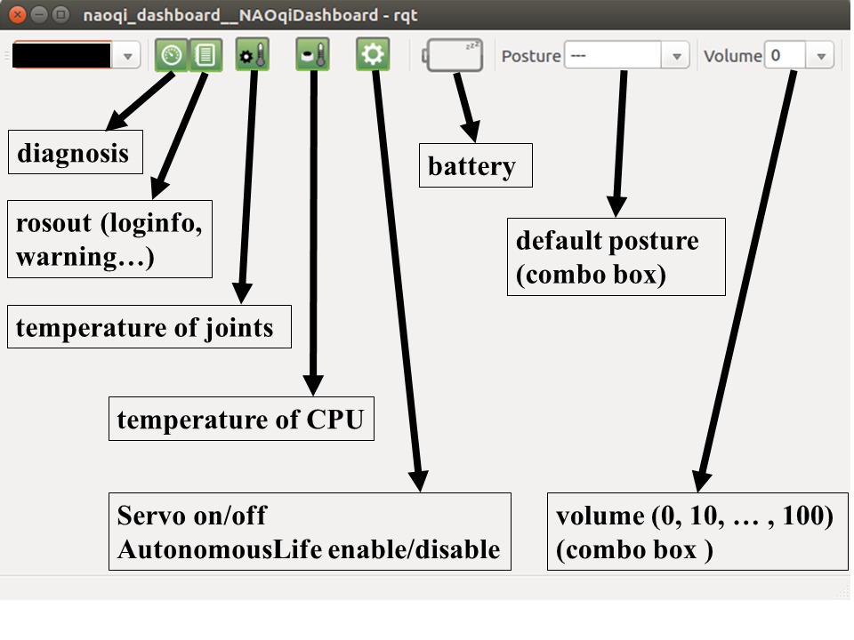

# jsk_nao_startup

## What's this?

contains JSK's launch file for startup NAO with ROS

## Running startup program

```
rossetip
roslaunch jsk_nao_startup jsk_nao_startup.launch network_interface:=<your network interaface (ex. eth0, enp0s31f6...)>
```

% For network_interface variable, please check `ifconfig` for the interface name your PC uses.

## Nodes, topics and services

These are a list of nodes and some useful topics and services from `jsk_nao_startup.launch`.

[nao_robot `kochigami-develop` branch](https://github.com/kochigami/nao_robot/tree/kochigami-develop) is used to draw this figure.

Main modification is [set namespace to `nao_full.launch` like `pepper_full.launch`](https://github.com/kochigami/nao_robot/commit/d9770dc76f812a8caf0b9d2b7d33ec55e6be6221).


### NAO robot

```
Publications:
 * /joint_states [sensor_msgs/JointState]
 * /nao_robot/audio [naoqi_bridge_msgs/AudioBuffer]
 * /nao_robot/bumper [naoqi_bridge_msgs/Bumper]
 * /nao_robot/camera/bottom/camera_info [sensor_msgs/CameraInfo]
 * /nao_robot/camera/bottom/image_raw [sensor_msgs/Image]
 * /nao_robot/camera/front/camera_info [sensor_msgs/CameraInfo]
 * /nao_robot/camera/front/image_raw [sensor_msgs/Image]
 * /nao_robot/chest_touch [naoqi_bridge_msgs/ChestButtonPressed]
 * /nao_robot/hand_touch [naoqi_bridge_msgs/HandTouch]
 * /nao_robot/head_touch [naoqi_bridge_msgs/HeadTouch]
 * /nao_robot/imu/base [sensor_msgs/Imu]
 * /nao_robot/imu/torso [sensor_msgs/Imu]
 * /nao_robot/info [naoqi_bridge_msgs/StringStamped]
 * /nao_robot/laser [sensor_msgs/LaserScan]
 * /nao_robot/odom [nav_msgs/Odometry]
 * /nao_robot/sonar/back [sensor_msgs/Range]
 * /nao_robot/sonar/front [sensor_msgs/Range]
 * /tf [tf2_msgs/TFMessage]

Subscriptions:
 * /cmd_vel [geometry_msgs/Twist]
 * /joint_angles [naoqi_bridge_msgs/JointAnglesWithSpeed]
 * /move_base_simple/goal [geometry_msgs/PoseStamped]
 * /speech [std_msgs/String]

Services:
 * /naoqi_driver/fade_leds
 * /naoqi_driver/get_language
 * /naoqi_driver/get_robot_config
 * /naoqi_driver/get_volume
 * /naoqi_driver/play_audio_file
 * /naoqi_driver/reset_leds
 * /naoqi_driver/set_language
 * /naoqi_driver/set_volume
```

### NAO's pose control

```
Publications:
 * /nao_robot/pose/get_life_state [std_msgs/String]

Action:
 * /nao_robot/pose/joint_trajectory [naoqi_bridge_msgs/JointTrajectoryAction]

Services:
 * /nao_robot/pose/life/disable
 * /nao_robot/pose/life/enable
 * /nao_robot/pose/life/get_state
 * /nao_robot/pose/rest
 * /nao_robot/pose/wakeup
```

### Joystick


|Button|Function            |
|:-----|:-------------------|
|1     |Servo on/off        |
|2     |Interactive Life    |
|3     |Disable Life        |
|4+5   |Move head-p, head-y |
|6+7   |Teleop Twist        |
|6+7+8 |Teleop Twist Turbo  |

Related nodes: `/joy_client`, `joy_node`, `/teleop_twist_joy` 

### Dashboard



Related nodes: `/naoqi_dashboard`, `/naoqi_dashboard_aggregator`, `/tf_monitor`