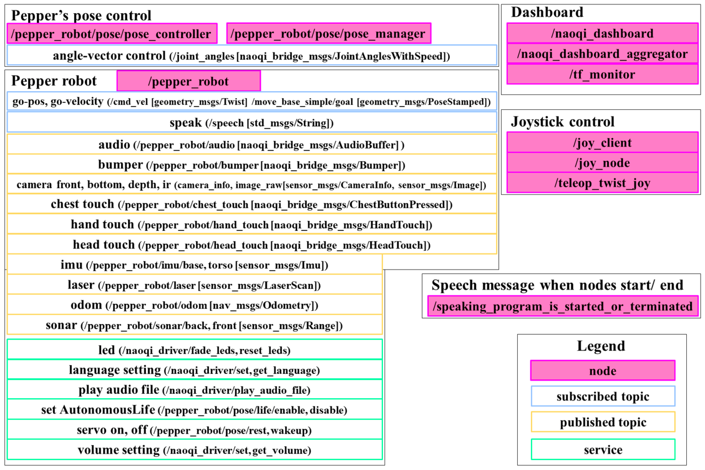
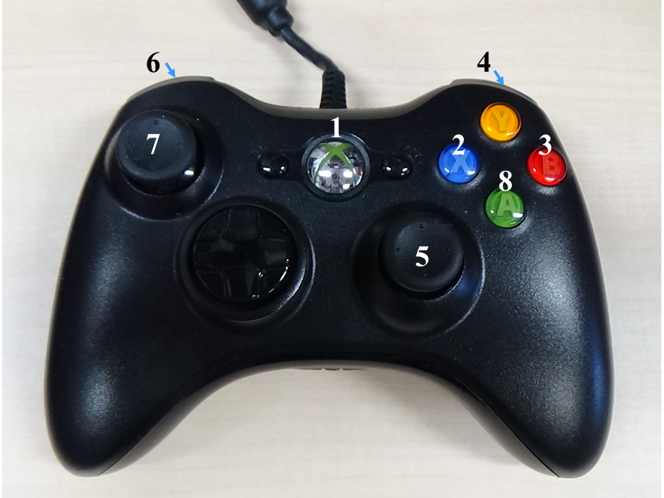
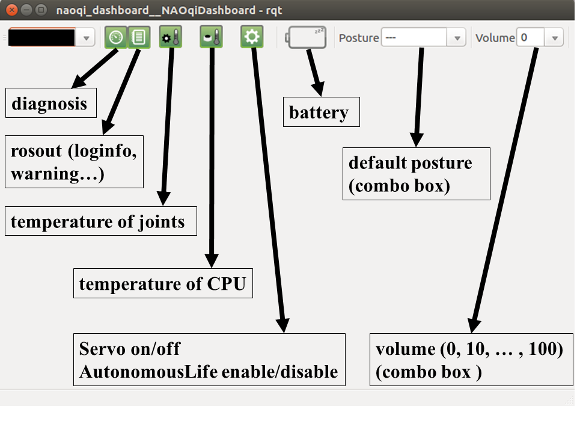

# jsk_pepper_startup

## What's this?

contains JSK's launch file for startup Pepper with ROS

## Running startup program

```
rossetip
roslaunch jsk_pepper_startup jsk_pepper_startup.launch network_interface:=<your network interaface (ex. eth0, enp0s31f6...)>
```

% For network_interface variable, please check `ifconfig` for the interface name your PC uses.  

% You can play audio stream from Pepper's audio ROS topic. Please see [here](https://github.com/jsk-ros-pkg/jsk_robot/pull/1073) for more details.

% In order to confirm if ROS-Pepper is booting, please check with rviz.

```
roscd pepper_bringup/config
rosrun rviz rviz -d pepper.rviz
```

## Control Pepper via roseus

Please refer to [README here](https://github.com/jsk-ros-pkg/jsk_robot/tree/master/jsk_naoqi_robot/peppereus).

## Nodes, topics and services

These are a list of nodes and some useful topics and services from `jsk_pepper_startup.launch`.



### Pepper robot

```
Publications:
 * /joint_states [sensor_msgs/JointState]
 * /pepper_robot/audio [naoqi_bridge_msgs/AudioBuffer]
 * /pepper_robot/bumper [naoqi_bridge_msgs/Bumper]
 * /pepper_robot/camera/bottom/camera_info [sensor_msgs/CameraInfo]
 * /pepper_robot/camera/bottom/image_raw [sensor_msgs/Image]
 * /pepper_robot/camera/depth/camera_info [sensor_msgs/CameraInfo]
 * /pepper_robot/camera/depth/image_raw [sensor_msgs/Image]
 * /pepper_robot/camera/front/camera_info [sensor_msgs/CameraInfo]
 * /pepper_robot/camera/front/image_raw [sensor_msgs/Image]
 * /pepper_robot/camera/ir/camera_info [sensor_msgs/CameraInfo]
 * /pepper_robot/camera/ir/image_raw [sensor_msgs/Image]
 * /pepper_robot/chest_touch [naoqi_bridge_msgs/ChestButtonPressed]
 * /pepper_robot/hand_touch [naoqi_bridge_msgs/HandTouch]
 * /pepper_robot/head_touch [naoqi_bridge_msgs/HeadTouch]
 * /pepper_robot/imu/base [sensor_msgs/Imu]
 * /pepper_robot/imu/torso [sensor_msgs/Imu]
 * /pepper_robot/info [naoqi_bridge_msgs/StringStamped]
 * /pepper_robot/laser [sensor_msgs/LaserScan]
 * /pepper_robot/odom [nav_msgs/Odometry]
 * /pepper_robot/sonar/back [sensor_msgs/Range]
 * /pepper_robot/sonar/front [sensor_msgs/Range]
 * /tf [tf2_msgs/TFMessage]

Subscriptions:
 * /cmd_vel [geometry_msgs/Twist]
 * /joint_angles [naoqi_bridge_msgs/JointAnglesWithSpeed]
 * /move_base_simple/goal [geometry_msgs/PoseStamped]
 * /speech [std_msgs/String]

Services:
 * /naoqi_driver/fade_leds
 * /naoqi_driver/get_language
 * /naoqi_driver/get_robot_config
 * /naoqi_driver/get_volume
 * /naoqi_driver/play_audio_file
 * /naoqi_driver/reset_leds
 * /naoqi_driver/set_language
 * /naoqi_driver/set_volume
```

### Pepper's pose control

```
Publications:
 * /pepper_robot/pose/get_life_state [std_msgs/String]

Action:
 * /pepper_robot/pose/joint_trajectory [naoqi_bridge_msgs/JointTrajectoryAction]

Services:
 * /pepper_robot/pose/life/disable
 * /pepper_robot/pose/life/enable
 * /pepper_robot/pose/life/get_state
 * /pepper_robot/pose/rest
 * /pepper_robot/pose/wakeup
```

### Joystick



|Button|Function            |
|:-----|:-------------------|
|1     |Servo on/off        |
|2     |Interactive Life    |
|3     |Disable Life        |
|4+5   |Move head-p, head-y |
|6+7   |Teleop Twist        |
|6+7+8 |Teleop Twist Turbo  |

Related nodes: `/joy_client`, `joy_node`, `/teleop_twist_joy` 

### Dashboard



Related nodes: `/naoqi_dashboard`, `/naoqi_dashboard_aggregator`, `/tf_monitor`

## Sample demo

```
roslaunch nao_apps speech.launch nao_ip:=YOUR_PEPPER_IP
roslaunch nao_interaction_launchers nao_vision_interface.launch nao_ip:=YOUR_PEPPER_IP
roslaunch nao_apps behaviors.launch nao_ip:=YOUR_PEPPER_IP
rosrun jsk_pepper_startup sample.l
$ (demo1) ;; Pepper may speak twice. (This will be fixed as soon as possible.)
```

## If you failed in launching jsk_pepper_startup.launch

1. Please try deleting all the terminals you created before, and even rebooting your PC.
If another terminal of ```roscore``` has been left and the connected network has changed recently, connecting your PC and pepper may fail.

2. If your terminal log looks like below, please reboot pepper.

```
front_cameraCamera Handle is empty - cannot retrieve image
front_cameraMight be a NAOqi problem. Try to restart the ALVideoDevice.
```

## Some tips

- If the getting started wizard appears on Pepper's tablet, it may be better to turn it off because some functions are blocked. (ref: [issue 926](https://github.com/jsk-ros-pkg/jsk_robot/issues/926))

- You may encounter the getting started wizard on Pepper's tablet when you turn on the Pepper robot. If you cannot turn it off, please try this: `roslaunch naoqi_apps behavior_manager.launch`. (`behavior_manager.launch` should exist in `naoqi_bridge` package (`kochigami-develop` branch).)  

If `rosservice call /behavior_manager/is_behavior_running "data: 'boot-config'"` => `success: True`,  
Please try `rosservice call /behavior_manager/stop_behavior "data: 'boot-config'"`.  
If `success: True` returns, you should turn off the wizard.  

You can also try `ssh nao@<Pepper's IP>` and
```
qicli call ALBehaviorManager.isBehaviorRunning boot-config
qicli call ALBehaviorManager.stopBehavior boot-config
```

- If you encounter the error below when you launch `naoqi_driver.launch`, please refer to [this issue](https://github.com/jsk-ros-pkg/jsk_robot/issues/1474).

```
what():	ALProxy::ALProxy
Can't find service: ROS-Driver-Audio
```