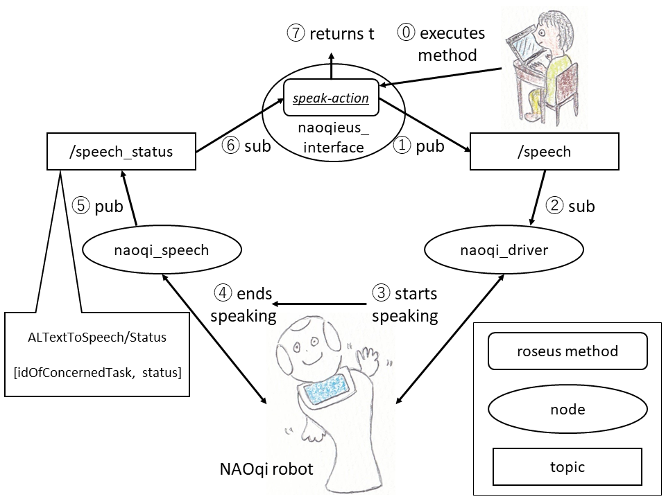

## :speak-action `str` `&optional (wait 60)` (naoqi_driver [`master`] and naoqi_apps [`kochigami-develop`])

### What is this?

This is a speak action. It waits and returns `t` after speaking a sentence finishes.

This method uses [ALTextToSpeech/Status](http://doc.aldebaran.com/2-5/naoqi/audio/altexttospeech-api.html#ALTextToSpeech/Status) to know when speaking a sentence finishes. This is defined in naoqi_apps/speech.launch [`kochigami-develop`].  

The figure below is a flow of this method.



### Parameters

`str`: speech sentence (str)

`wait`: max wait time [sec] while speaking a sentence (float (default 60))

### Location

`naoqi_driver/launch/naoqi_driver.launch`

`naoqi_apps/launch/speech.launch`

### NAOqi API

[ALTextToSpeechProxy::say](http://doc.aldebaran.com/2-5/naoqi/audio/altexttospeech-api.html#ALTextToSpeechProxy::say__ssCR)

[ALTextToSpeech/Status](http://doc.aldebaran.com/2-5/naoqi/audio/altexttospeech-api.html#ALTextToSpeech/Status)

### Sample

```
send *ri* :speak-action "Hello, my name is Hop. Nice to meet you. I like Sukiyaki. How about you?"
[ INFO] [1547277401.665943347]: subscribing speech_status
[ INFO] [1547277402.165140869]: subscribing speech_status
[ INFO] [1547277402.665047236]: subscribing speech_status
[ INFO] [1547277403.165137494]: subscribing speech_status
[ INFO] [1547277403.665055341]: subscribing speech_status
[ INFO] [1547277404.165135809]: subscribing speech_status
[ INFO] [1547277404.665330840]: subscribing speech_status
[ INFO] [1547277405.165178278]: subscribing speech_status
[ INFO] [1547277405.665018189]: subscribing speech_status
[ INFO] [1547277406.165078145]: subscribing speech_status
[ INFO] [1547277406.664587612]: subscribing speech_status
[ INFO] [1547277407.165133282]: subscribing speech_status
[ INFO] [1547277407.665196644]: subscribing speech_status
t ; t returns after saying a sentence 
```