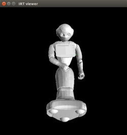
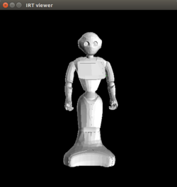

# peppereus

This is a NAO-specific package for roseus interface.

## How to make pepper model on euslisp

Install pepper mesh files with manual approval of license
```
sudo apt-get install ros-<ros version>-pepper-meshes
catkin build
```

## Control Pepper via roseus

```
(load "package://peppereus/pepper-interface.l") ;; load modules
(setq *pepper* (pepper))          ;; creat a robot model
(setq *ri* (instance pepper-interface :init)) ;; make connection to the real robot
(objects (list *pepper*))        ;; display the robot model
```
or

```
(load "package://peppereus/pepper-interface.l") ;; load modules
(pepper-init)
```

## How to try methods

1. [roslaunch jsk_pepper_startup.launch](../jsk_pepper_statup/README.md)  
2. Please refer to [Control Pepper via roseus](https://github.com/jsk-ros-pkg/jsk_robot/blob/master/jsk_naoqi_robot/peppereus/README.md#control-pepper-via-roseus).  
3. Please try methods, you can refer to the explanations below how to try them. If there is a sign of `kochigami-develop`, please follow [Interface when controlling NAO and Pepper via roseus](../README.md#interface-when-controlling-nao-and-pepper-via-roseus). 

## Methods

***Tablet***  

By using tablet-related methods, we can show image, app, html file and web page on the tablet.  

- [:get-show-image-folder-path (naoqi_bridge [`kochigami-develop`])](doc/get_show_image_folder_path.md)  

- [:hide-image (naoqi_bridge [`kochigami-develop`])](doc/hide_image.md)  

- [:set-show-image-folder-path `name` (naoqi_bridge [`kochigami-develop`])](doc/set_show_image_folder_path.md)  

- [:show-app `app` (naoqi_bridge [`kochigami-develop`])](doc/show_app.md)  

- [:show-image `file` (naoqi_bridge [`kochigami-develop`])](doc/show_image.md)  

- [:show-webview `url` (naoqi_bridge [`kochigami-develop`])](doc/show_webview.md)

***Trouble Shooting***

- How to log in to a robot?
```
ssh nao@<Your robot IP>
```

- How to send a file to a robot?
```
scp <file path of your local PC> nao@<Your robot IP>:/home/nao/.local/share/PackageManager/apps/img/html/
```

- If this kind of error occurs at `tablet.launch`, please re-launch the program. 
```
[ERROR] [1543212108.209135]: Exception caught:
	ALTabletService::showImage
		module destroyed
```

## Joints of Pepper

Here is a list of joints when accessing Pepper.

ex:  
```
(send *pepper* :reset-pose)
=> #f(2.0 -2.0 -5.0 85.0 10.0 -70.0 -20.0 -40.0 85.0 -10.0 70.0 20.0 40.0 0.0 0.0)
       0    1    2   3    4     5     6     7    8     9    10   11   12   13  14
```

```
0: :knee-p
1: :hip-r
2: :hip-p
3: :larm :shoulder-p
4: :larm :shoulder-r
5: :larm :elbow-y
6: :larm :elbow-p
7: :larm :wrist-y
8: :rarm :shoulder-p
9: :rarm :shoulder-r
10: :rarm :elbow-y
11: :rarm :elbow-p
12: :rarm :wrist-y
13: :head :neck-y
14: :head :neck-p
```

### How to send angle vector

```
(send *pepper* :head :neck-y :joint-angle -10)
(send *ri* :angle-vector (send *pepper* :angle-vector)
```

### How to send sequences of angle vector

```
(setq *reset-pose* #f(2.0 -2.0 -5.0 85.0 10.0 -70.0 -20.0 -40.0 85.0 -10.0 70.0 20.0 40.0 0.0 0.0))
(setq *hello-pose1* #f(2.0 -2.0 -5.0 85.0 10.0 30.0 -0.5 30.0 -20.0 -10.0 70.0 20.0 40.0 30.0 0.0))
(setq *hello-pose2* #f(2.0 -2.0 -5.0 85.0 10.0 -70.0 -20.0 -40.0 0.0 -10.0 70.0 20.0 40.0 0.0 0.0))

(setq *hello-pose-list* (list *reset-pose* *hello-pose1* *hello-pose2* *reset-pose*))
(setq *hello-time-list* (list 2000 3000 4000 5000))

(send *ri* :angle-vector-sequence *hello-pose-list* *hello-time-list*)
```

## Default poses

They are defined in `pepper.yaml`.

`:bowing-pose`



`:greeting-pose`


`:look-foot`


`:nodding-pose`


`:ok-pose`


`:pointing-left-pose`


`:pointing-right-pose`


`:raise-left-hand-high`


`:raise-left-hand-low`


`:raise-right-hand-high`


`:raise-right-hand-low`


`:reset-pose`



`:show-bottom-camera`


`:show-head`


`:show-top-camera`


`:spread-hands-smally`


`:spread-hands-widely`


`:touch-speakers`


`:watching-pose`


`:wondering-pose`


`:c-pose`


`:hiragana-tsu-pose`

