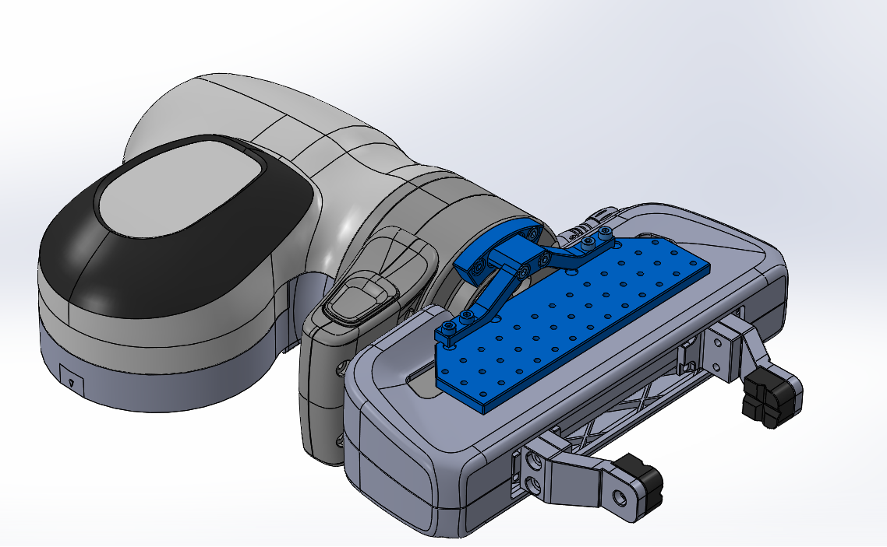

# Tool mounter
Mounting any tools onto panda-hand.  Plate mounter has M3 screw wholes placed by 10mm x 10mm.

Designed by Yoichiro Kawamura.

# tweezers
Expansion parts to grasp small things.

Designed by Koki Amabe.
