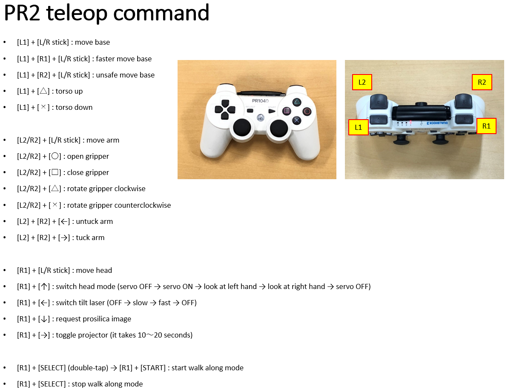

jsk_pr2_robot
=============

## Teleoperation

For the JSK safe teleop system, please see [data flow diagram of safe_teleop.launch](https://github.com/jsk-ros-pkg/jsk_robot/tree/master/jsk_robot_common/jsk_robot_startup#launchsafe_teleoplaunch)




## Setup for Development Users
```
mkdir -p catkin_ws/my_first_demo
cd catkin_ws/my_first_demo
wstool init src
wstool set jsk_demos https://github.com/jsk-ros-pkg/jsk_demos -t src --git
wstool update -t src
source ~applications/ros/hydro/devel/setup.bash
catkin b
```


## Setup for Application Users (for administrator only)

use [jsk_pr2.rosinstall](https://github.com/jsk-ros-pkg/jsk_robot/blob/master/jsk_pr2_robot/jsk_pr2_startup/jsk_pr2.rosinstall) to install software
```
mkdir -p ros/hydro/src
cd ros/hydro
wstool init src
git clone https://github.com/jsk-ros-pkg/jsk_robot.git src/jsk-ros-pkg/jsk_robot
wget -O src/.rosinstall https://raw.githubusercontent.com/jsk-ros-pkg/jsk_robot/master/jsk_pr2_robot/jsk_pr2_startup/jsk_pr2.rosinstall
wstool update -t src
rosdep install --from-paths src --ignore-src -r -y
catkin b
```
