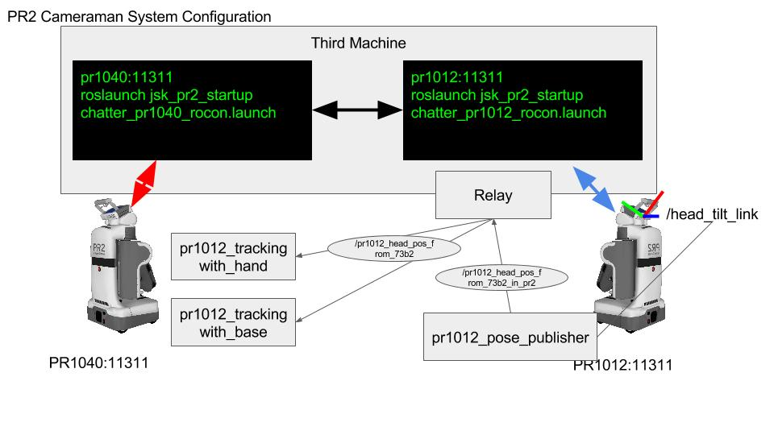

Samples
=======

- chatter_sample

This will publish to each other the "Hello Wolrd".

```
In One Terminal
$ rossetpr1040
$ roslaunch jsk_pr2_startup chatter_pr1040_rocon.launch

In Another Terminal
$ rossetpr1012
$ roslaunch jsk_pr2_startup chatter_pr1012_rocon.launch
```

- look_sample

PR1040 will look at PR1012.

```
In One Terminal
$ rossetpr1040
$ roslaunch jsk_pr2_startup look_pr1040_rocon.launch

In Another Terminal
$ rossetpr1012
$ roslaunch jsk_pr2_startup look_pr1012_rocon.launch
```
- cameraman_sample

PR1040 will become cameraman , get PR1012 pos and direct the grapsed camera to PR1012.

```
In PR1040
One Terminal
$ rosrun jsk_pr2_startup pr1012_tracking_with_hand.l
Another Terminal
$ rosrun jsk_pr2_startup pr1012_tracking_with_base.l

In PR1012
One Terminal
$ rosrun jsk_pr2_startup pr1012_pose_publisher.l

In One Terminal on Third Machine
$ rossetpr1040
$ roslaunch jsk_pr2_startup cameraman_pr1040_rocon.launch

In Another Terminal  on Third Machine
$ rossetpr1012
$ roslaunch jsk_pr2_startup cameraman_pr1012_rocon.launch
```

