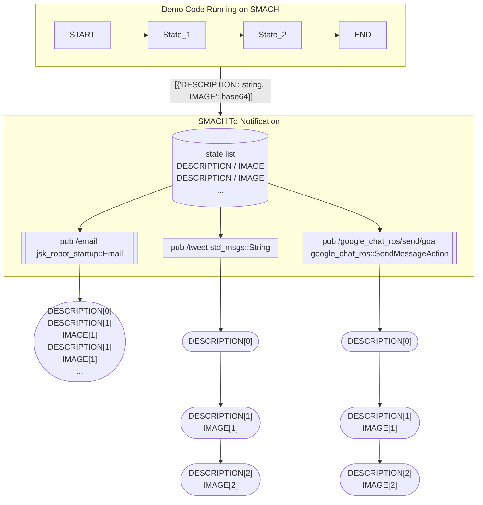

jsk_robot_startup
===

## lifelog

see [lifelog/README.md](lifelog/README.md)

## scripts/email_topic.py

This node sends email based on received rostopic (jsk_robot_startup/Email).
Default values can be set by using `~email_info`
There is [a client library](./euslisp/email-topic-client.l) and [sample program](./euslisp/sample-email-topic-client.l).
If you want to see a demo. Please [configure a smtp server](https://github.com/jsk-ros-pkg/jsk_robot/tree/master/jsk_robot_common/jsk_robot_startup#configuring-a-smtp-server-with-gmail) and setup your email_info yaml at /var/lib/robot/email_info.yaml and run.

```bash
roslaunch jsk_robot_startup sample_email_topic.launch receiver_address:=<a mail address to send a mail to>
```

### Parameters

- `~email_info` (type: `String`, default: `/var/lib/robot/email_info.yaml`)

Default values of email configuration. Example of a yaml file is below.

```yaml
subject: hello
body: world
sender_address: hoge@test.com
receiver_address: fuga@test.com
smtp_server: test.com
smtp_port: 25
attached_files:
  - /home/user/Pictures/test.png
```

### Subscriber

- `email` (type: `jsk_robot_startup/Email`)

Subscriber of email command.

## scripts/ConstantHeightFramePublisher.py


This script provides a constant height frame from the ground to get a imagenary laser scan for pointcloud_to_laserscan package.
Biped robots need to use this constant frame to get constant laser scan for 2D SLAM package for wheeled ones like gmapping,
because the pose of biped robots including height of the base link changes during a task in contrast to wheeled ones.
In this frame, x, y and yaw is same as base frame of the robot body, z is constant and roll and pitch is same as the ground.

### Parameters

* `~parent_frame` (String, default: "BODY")

  This parameter indicates the parent frame of the constant height frame, which is expected to be a base frame of the robot body.

* `~odom_frame` (String, default: "odom")

  This parameter indicates the odometry frame on the ground.

* `~frame_name` (String, default: "pointcloud_to_scan_base")

  This parameter indicates the name of the constant frame.

* `~rate` (Double, default: 10.0)

  This parameter indicates publish rate [Hz] of the constant frame.

* `~height` (Double, default: 1.0)

  This parameter indicates initial height [m] of the constant frame.

### Subscribing Topics

* `~height` (`std_msgs/Float64`)

  This topic modifies height [m] of the constant frame.

## util/initialpose_publisher.l

This script sets initial pose with relative pose from specified TF frame by publishing `/initialpose`.

### Parameters

* `~transform_base` (String, default: "map")

  TF frame of publishing topic `/initialpose`.
  
* `~transform_frame` (String, default: "eng2/7f/73B2")

  Base TF frame to calcurate relative initial pose
  
* `~initial_pose_x` (Double, default: 0.0)

  Relative pose x

* `~initial_pose_y` (Double, default: 0.0)

  Relative pose y

* `~initial_pose_yaw` (Double, default: 0.0)

  Relative pose yaw


### Subscribing Topics

* `/amcl_pose` (`geometry_msgs/PoseWithcovariancestamped`)


## util/mux_selector.py

This node check and select mux input topic on condition of the specified topic.
This node takes three arguments for one topic.
The first one is the topic to be monitored.
When a message from this topic is received, it is assigned as a variable `m`.
If a condition specified as the second argument,
this node calls a service to select the topic specified as the third argument.

### Usage

```
rosrun jsk_robot_startup mux_selector.py /joy1 'm.buttons[9]==1' /cmd_vel1 /joy2 'm.buttons[9]==1' /cmd_vel2
```

### Parameters

* `~patient` (Double, default: 0.5)

  Indicates the allowable range of the difference between the received topic time and the current time.

* `~frequency` (Double, default: 20.0)

  Frequency of processing loop.

* `~default_select` (String, default: `None`)

  Default topic name.

* `~wait` (Bool, default: `False`)

  If wait is `True`, this node waits for the topic to be received.

### Subscribing Topics

The topic specified in the argument is subscribed.


## scripts/check_room_light.py

This node publish the luminance calculated from input image and room light status.

### Subscribing Topics

* `~input` (`sensor_msgs/Image` or `sensor_msgs/CompressedImage`)

  Input topic image

### Publishing Topics

* `~output` (`jsk_robot_startup/RoomLight`)

  Room light status and room luminance


### Parameters

* `~luminance_threshold` (Float, default: 50)

  Luminance threshold to deteremine whether room light is on or off

* `~image_transport` (String, default: raw)

  Image transport hint.

## scripts/shutdown.py

This node shuts down or reboots the robot itself according to the rostopic. Note that this node needs to be run with sudo privileges.

### Subscribing Topics

* `shutdown` (`std_msgs/Empty`)

  Input topic that trigger shutdown.

  If `~input_condition` is set, evaluated `~input_condition` is `True` and this node received this topic, shutdown will be executed.

  If you want to force a shutdown in any case, set `~input_condition` to `None` and send `shutdown` topic.

* `reboot` (`std_msgs/Empty`)

  Input topic that trigger reboot

* `~input` (`AnyMsg`)

  Input ros message for `~input_condition`.


### Parameters

* `~shutdown_command` (String, default: "/sbin/shutdown -h now")

  Command to shutdown the system. You can specify the shutdown command according to your system.

* `~reboot_command` (String, default: "/sbin/shutdown -r now")

  Command to reboot the system. You can specify the reboot command according to your system.

* `~input_condition` (String, default: ``None``)

  Specify condition to run `~shutdown_command` even if shutdown topic is received. Use a Python expression that returns a bool value.
  In addition to a Python builtin functions, you can use ``topic`` (the topic of the message), ``m`` (the message) and ``t`` (time of message).

  For example, ``~input`` topic is ``std_msgs/String`` and if you want to check whether a sentence is a ``hello``, you can do the following.

  ```
  input_condition: m.data == 'hello'
  ```

  If you want to check the frame id of the header, you can do the following.

  ```
  input1_condition: m.header.frame_id in ['base', 'base_link']
  ```

  For example, to prevent shutdown while the real Fetch is charging, write as follows.

  ```
  input_condition: 'm.is_charging is False'
  ```

  In this case, the `~input` is the `/battery_state` (`power_msgs/BatteryState`) topic.
  `power_msgs/BatteryState` has the following values and `is_charging` is `True` if charging, `False` otherwise.

  ```
  $ rosmsg show power_msgs/BatteryState
  string name
  float32 charge_level
  bool is_charging
  duration remaining_time
  float32 total_capacity
  float32 current_capacity
  float32 battery_voltage
  float32 supply_voltage
  float32 charger_voltage
  ```

  Note that, use escape sequence when using the following symbols ``<(&lt;)``, ``>(&gt;)``, ``&(&amp;)``, ``'(&apos;)`` and ``"(&quot;)``.

### Usage

```
# Launch node
$ su [sudo user] -c ". [setup.bash]; rosrun jsk_robot_startup shutdown.py"
# To shutdown robot
rostopic pub /shutdown std_msgs/Empty
# To restart robot
rostopic pub /reboot std_msgs/Empty
```


## scripts/smach_to_mail.py

This node sends smach messages to `/email`, `/tweet`, etc... to notify robot state transition.



### Subscribing Topics

* `~smach/container_status` (`smach_msgs/SmachContainerStatus`)

  Input topic smach status

### Publishing Topics

* `/email` (`jsk_robot_startup/Email`)

  Email message with description and image

* `/tweet` (`std_msgs/String`)

  Tweet message with description and image

* `/google_chat_ros/send/goal` (`google_chat_ros/SendMessageActionGoal`)

  Send google chat message with description and image.

### Parameters

* `~sender_address` (String)

  Sender address

* `~receiver_address` (String)

  Receiver address

* `~google_chat_space` (String)

  Receiver Google Chat space name

* `~google_chat_tmp_image_dir` (String)

  Directory where images are temporarily stored for google_chat_ros

## launch/safe_teleop.launch

This launch file provides a set of nodes for safe teleoperation common to mobile robots. Robot-specific nodes such as `/joy`, `/teleop` or `/cable_warning` must be included in the teleop launch file for each robot, such as [safe_teleop.xml for PR2](https://github.com/jsk-ros-pkg/jsk_robot/blob/master/jsk_pr2_robot/jsk_pr2_startup/jsk_pr2_move_base/safe_teleop.xml) or [safe_teleop.xml for fetch](https://github.com/jsk-ros-pkg/jsk_robot/blob/master/jsk_fetch_robot/jsk_fetch_startup/launch/fetch_teleop.xml).


## launch/rfcomm_bind.launch

This script binds rfcomm device to remote bluetooth device. By binding rfcomm device, we can connect bluetooth device via device file (e.g. `/dev/rfcomm1`). For example, rosserial with [this PR](https://github.com/ros-drivers/rosserial/pull/569) can be used over bluetooth connection.

### Usage

Save the bluetooth device MAC address to file like `/var/lib/robot/rfcomm_devices.yaml`.

```
- name: device1
  address: XX:XX:XX:XX:XX:XX
- name: device2
  address: YY:YY:YY:YY:YY:YY
```

Then, bind rfcomm devices.

```
roslaunch jsk_robot_startup rfcomm_bind.launch
```

To check how many devices are bound to rfcomm, use rfcomm command.
```
rfcomm
```

## Tips
### Configuring a smtp server with Gmail
1. Setting postfix

Add following codes to `/etc/postfix/main.cf`
```
relayhost = smtp.gmail.com:587
smtp_sasl_auth_enable = yes
smtp_sasl_password_maps = hash:/etc/postfix/gmail_passwd
smtp_sasl_security_options = noanonymous
smtp_sasl_mechanism_filter = plain
smtp_use_tls = yes
```
2. Create and register a password file

Create `/etc/postfix/gmail_passwd`
```
# /etc/postfix/gmail_passwd
smtp.gmail.com:587 <example>@gmail.com:<login password or application password>
```
Register `/etc/postfix/gmail_passwd`
```bash
$ sudo postmap /etc/postfix/gmail_passwd
```
If you find `/etc/postfix/gmail_passwd.db`, it works well.

3. Reload postfix
```bash
$ sudo postfix reload
```

