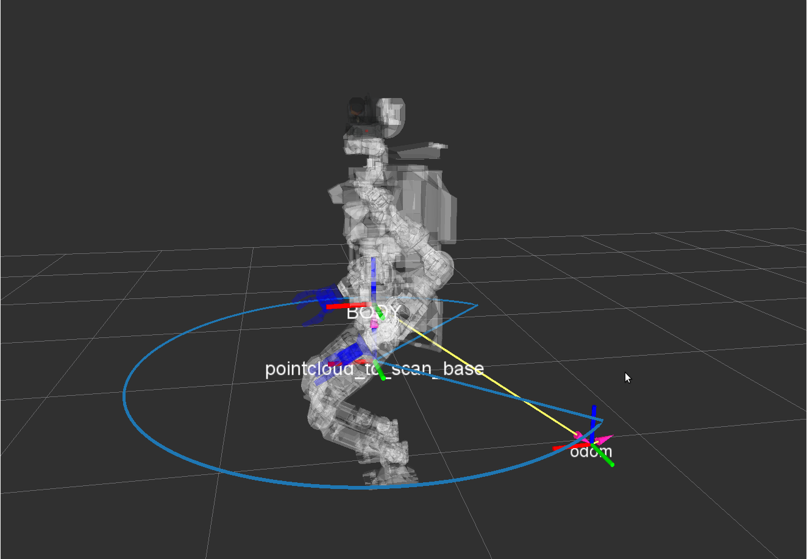
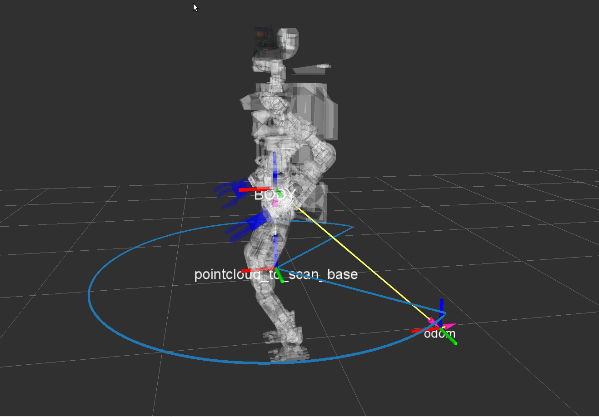
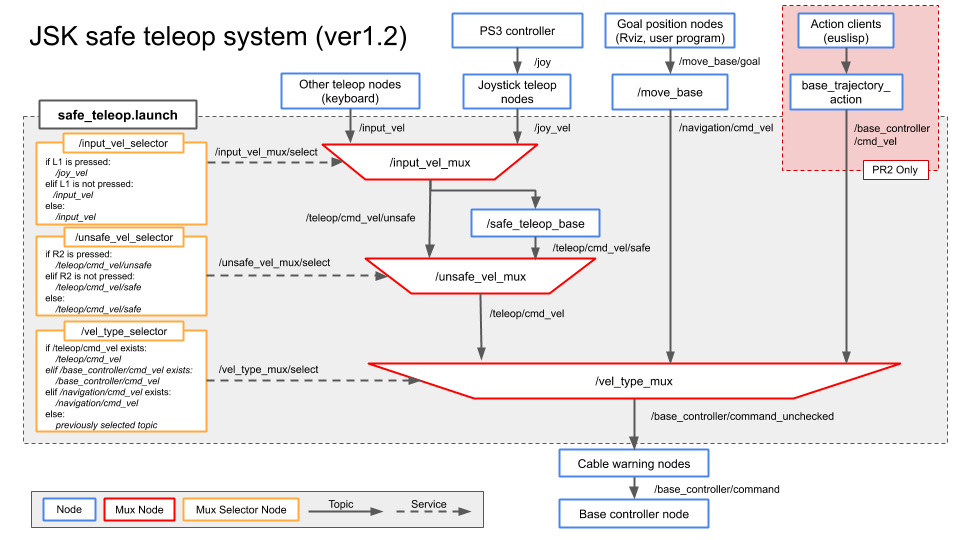

jsk_robot_startup
===

## lifelog

see [lifelog/README.md](lifelog/README.md)

## scripts/ConstantHeightFramePublisher.py



This script provides a constant height frame from the ground to get a imagenary laser scan for pointcloud_to_laserscan package.
Biped robots need to use this constant frame to get constant laser scan for 2D SLAM package for wheeled ones like gmapping,
because the pose of biped robots including height of the base link changes during a task in contrast to wheeled ones.
In this frame, x, y and yaw is same as base frame of the robot body, z is constant and roll and pitch is same as the ground.

### Parameters

* `~parent_frame` (String, default: "BODY")

  This parameter indicates the parent frame of the constant height frame, which is expected to be a base frame of the robot body.

* `~odom_frame` (String, default: "odom")

  This parameter indicates the odometry frame on the ground.

* `~frame_name` (String, default: "pointcloud_to_scan_base")

  This parameter indicates the name of the constant frame.

* `~rate` (Double, default: 10.0)

  This parameter indicates publish rate [Hz] of the constant frame.

* `~height` (Double, default: 1.0)

  This parameter indicates initial height [m] of the constant frame.

### Subscribing Topics

* `~height` (`std_msgs/Float64`)

  This topic modifies height [m] of the constant frame.

## util/initialpose_publisher.l

This script sets initial pose with relative pose from specified TF frame by publishing `/initialpose`.

### Parameters

* `~transform_base` (String, default: "map")

  TF frame of publishing topic `/initialpose`.
  
* `~transform_frame` (String, default: "eng2/7f/73B2")

  Base TF frame to calcurate relative initial pose
  
* `~initial_pose_x` (Double, default: 0.0)

  Relative pose x

* `~initial_pose_y` (Double, default: 0.0)

  Relative pose y

* `~initial_pose_yaw` (Double, default: 0.0)

  Relative pose yaw


### Subscribing Topics

* `/amcl_pose` (`geometry_msgs/PoseWithcovariancestamped`)


## util/mux_selector.py

This node check and select mux input topic on condition of the specified topic.
This node takes three arguments for one topic.
The first one is the topic to be monitored.
When a message from this topic is received, it is assigned as a variable `m`.
If a condition specified as the second argument,
this node calls a service to select the topic specified as the third argument.

### Usage

```
rosrun jsk_robot_startup mux_selector.py /joy1 'm.buttons[9]==1' /cmd_vel1 /joy2 'm.buttons[9]==1' /cmd_vel2
```

### Parameters

* `~patient` (Double, default: 0.5)

  Indicates the allowable range of the difference between the received topic time and the current time.

* `~frequency` (Double, default: 20.0)

  Frequency of processing loop.

* `~default_select` (String, default: `None`)

  Default topic name.

* `~wait` (Bool, default: `False`)

  If wait is `True`, this node waits for the topic to be received.

### Subscribing Topics

The topic specified in the argument is subscribed.


## launch/safe_teleop.launch

This launch file provides a set of nodes for safe teleoperation common to mobile robots. Robot-specific nodes such as `/joy`, `/teleop` or `/cable_warning` must be included in the teleop launch file for each robot, such as [safe_teleop.xml for PR2](https://github.com/jsk-ros-pkg/jsk_robot/blob/master/jsk_pr2_robot/jsk_pr2_startup/jsk_pr2_move_base/safe_teleop.xml) or [safe_teleop.xml for fetch](https://github.com/jsk-ros-pkg/jsk_robot/blob/master/jsk_fetch_robot/jsk_fetch_startup/launch/fetch_teleop.xml).


