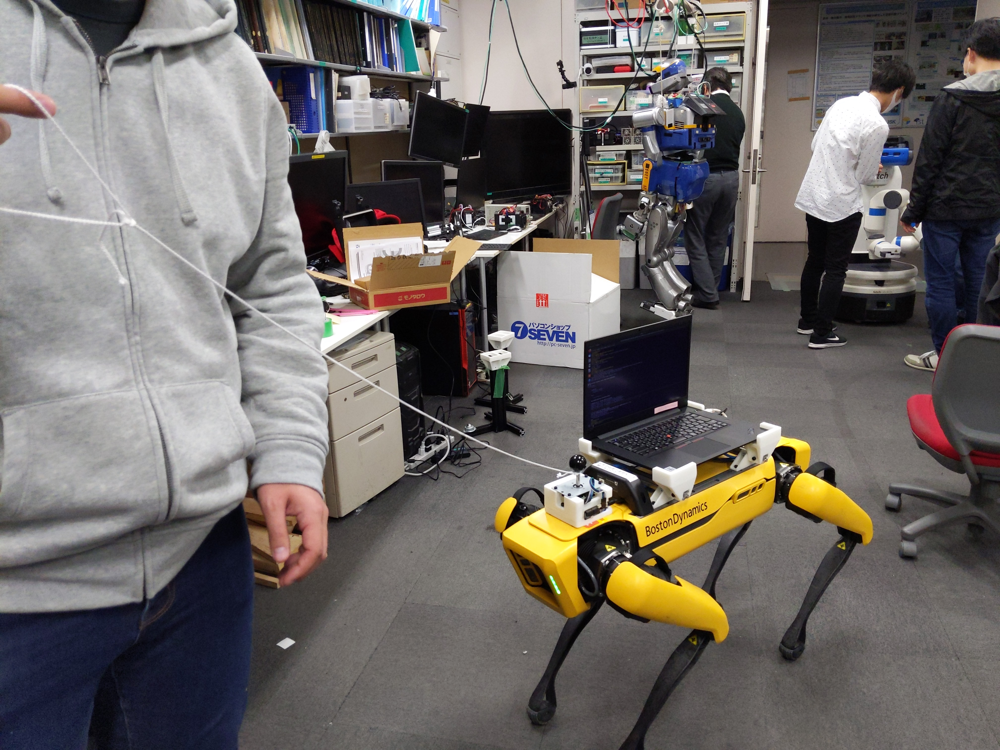
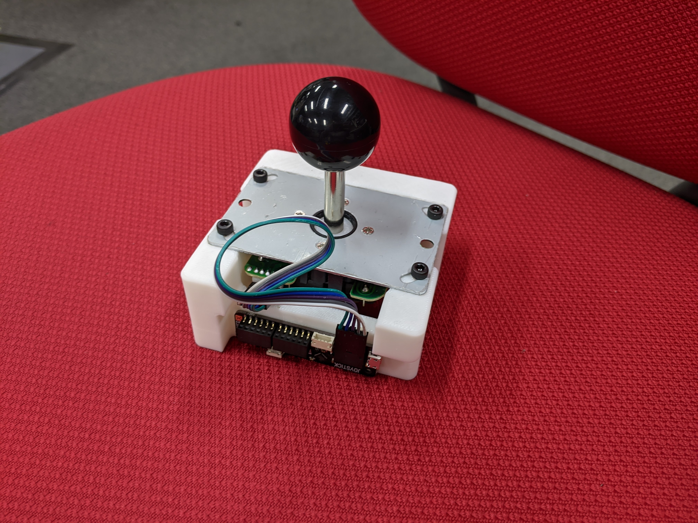

# jsk_spot_head_joy

This package is for the head joystick module for Spot.



# Head Joystick Module

The head joystick module is consists of parts below.

* [Joystick in Arcade Parts Kit](https://www.switch-science.com/catalog/5792/)
* [Player X USB Games Controller USB](https://www.switch-science.com/catalog/5793/)
* [Housing Part for JSK Spot Headmounted module](./designs/joy_mount_housing.stl)



Please assemble them, wire jumper cables from the joystick to Player X, and attach it to [the Headmounted module](../jsk_spot_startup/README.md).
And please connect a USB-micro cable from PC to the module according to the picture above

# Usage

First, please launch driver.launch in jsk_spot_startup.
And please launch head_teleop.launch

```
$ roslaunch jsk_spot_head_joy head_teleop.launch
```

Now you can control Spot with the Head Joystick Module


# Attention

Current version of Head joystick module does not have an enable button, which means the robot will move without any safety trigger if the joystick is moved.
