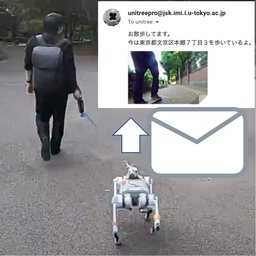

# jsk_unitree_startup

## app_manager

The unitree launches various apps via [app_manager](https://github.com/pr2/app_manager).

You can launch the app from the browser by accessing this [url](http://192.168.123.161:8000/rwt_app_chooser/).

### Walk Notifier

Send an email with the location of the walk and a camera image of the walk.



#### prerequirement

The key for google map needs to be placed in `/var/lib/robot/google_map_location_key.yaml` (pi@192.168.123.161) with 'location_key' as the key.

For JSK members, the yaml file are available at [Google Drive](https://drive.google.com/file/d/1D867WB70GDEN0g9IKXfoTHk-5MUJFiuf/view?usp=sharing)

Also, place a yaml file with the email addresses of the sender and receiver in `/var/lib/robot/walk_notifier.yaml`.

```
sender_address: hogehoge@some.mail.com
receiver_address: foo@some.mail.com
```
